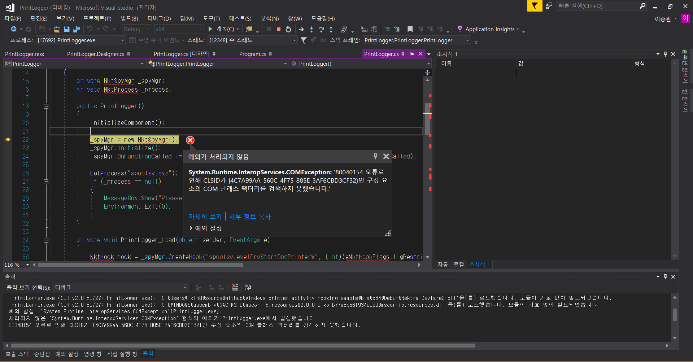

# Scenario 종추Ver
> 1. When a printer request comes in.
> 2. `The spoolsv.exe` process runs automatically.
> 3. **DLL Injection** works with `typepress.dll`.
> 4. Activate the **authentication** process.  
> 5-1. Login **Success** -> **Print O** 
> 5-2. Login **Failed** -> **Print X**

# History
- First commit about view.(19.07.23~)
- Following Deviare2 & windows-printer-activity-hooking-sample (19.07.25~) 
  Ref. 
  - PM tutorial : https://github.com/srw/windows-printer-activity-hooking-sample 
  - Deviare2 git : https://github.com/nektra/Deviare2
  - Deviare2 article : https://blog.nektra.com/main/2012/05/18/logging-printer-activity/
  - Deviare2 tutorial : https://blog.nektra.com/main/2012/05/18/logging-printer-activity/
  - spoolsv.exe : https://github.com/jongwuner/Etc/wiki/Spoolsv.exe-%3F
- *Solution* is DLL Injection : https://reversecore.com/38?category=216978

# Issues
- Following Deviare Tutorial. 
  -   

- ## Doing DLL Injection Tutorial(19.07.26~)
  - https://reversecore.com/38?category=216978
  - *Success* Notepad DLL Injection(19.07.29) 
    - link. https://github.com/jongwuner/Etc/tree/master/Hooking/DLL%20Injection_Notepad
    - ref. https://wendys.tistory.com/23
  - 회식이 너무 많아 ㅠㅠㅠㅠㅠ(19.08.01)

# To-do
- CodeReview(DLL && DLLInjection)
- Login-View
- Connect DB
- Following Deviare Print Monitor
   - https://github.com/22hours/HIS/tree/master/15JeongHwan
