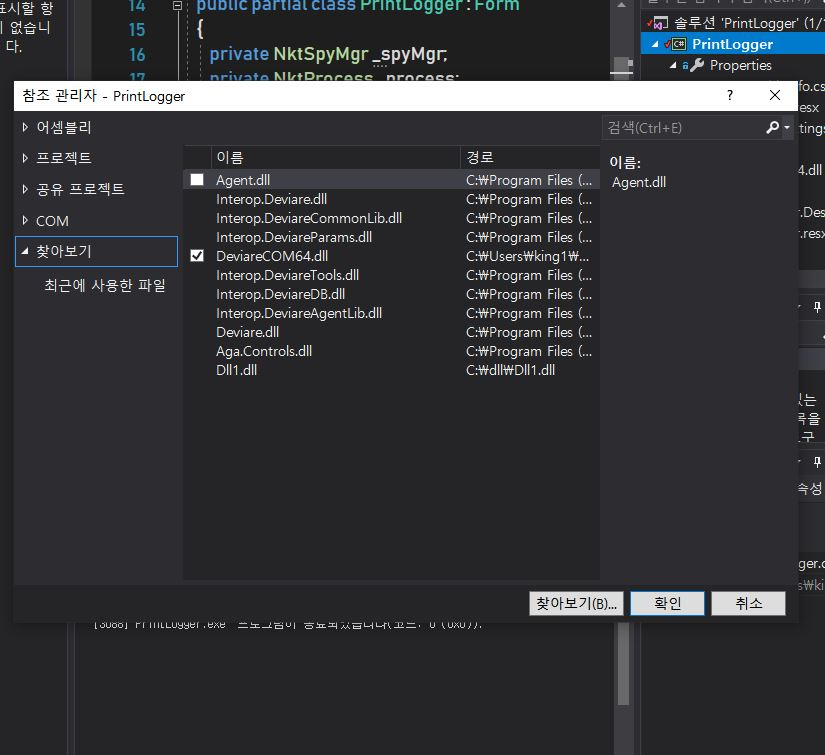
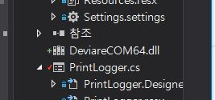
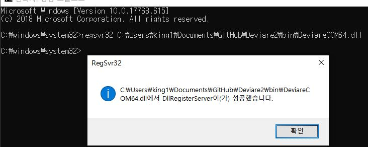
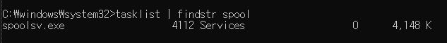
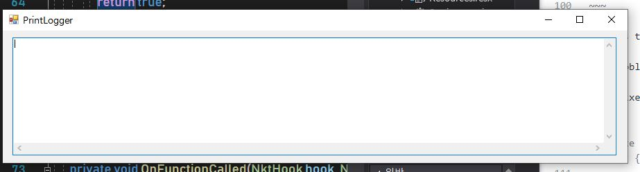
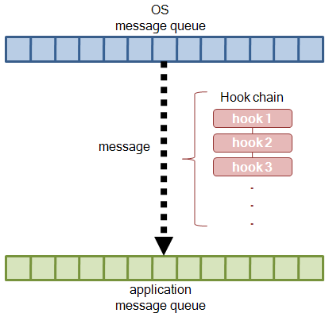
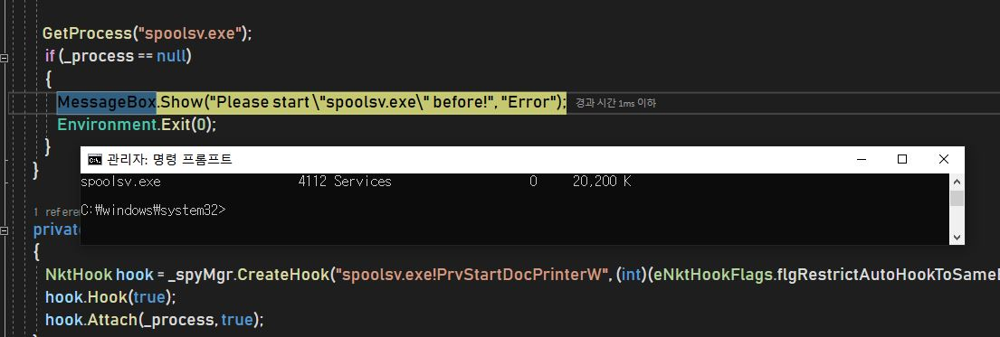

## 활자 인쇄소 

## GOAL : CONTROL ALL DOC ON PRINTER
 
---
### 2019-07-28 Commit!!

#### Success

Now i successfully comfile "Printer Logger" !

So now i explicate how i can successfully do that

#### Problem 1

We did not initialize the "NktSpyMgr" class 

and this is the code in question

~~~
       public PrintLogger()
        {
            InitializeComponent();

            _spyMgr = new NktSpyMgr(); <== Here's the point of our problems
            _spyMgr.Initialize();
            _spyMgr.OnFunctionCalled += new DNktSpyMgrEvents_OnFunctionCalledEventHandler(OnFunctionCalled);
~~~

When we call the "NktSpyMgr"s constructor we very unfortunately meet fucking exception ...

this except reason is Deivare's 32 bit dll ... (DeviareCOM64.dll)

#### Solve Problem 1

To solve problem 1 we need to know why this exception occurred!

The reason is so simple because DeviareCOM64.dll is 32bit dynamic link lib....

**So First**

add the reference in your visual studio like this

the sequence is " right click in your project -> add -> reference -> browse -> find the Deviare64.COM -> add! "

this is reuslt view..

**In Second**

You need add the register, So start cmd with administator auth and run this order,

"regsvr32 yourPath\DeviareCOM64.dll"

> note that my path is regsvr32 C:\Users\king1\Documents\GitHub\Deviare2\bin\DeviareCOM64.dll 

#### Problem 2

I thought when I'd solve the first problem all problem's gone...

but not long after i've faced another problems

this problem is this program can't catch the "spoolsv.exe" ..

so i made sure "spoolsv.exe" is now running

Ironically "spoolsv.exe" is Running now ..

So the problem has become clear

the only problem is in the code..

~~~
private bool GetProcess(string proccessName)
        {
            NktProcessesEnum enumProcess = _spyMgr.Processes();
            NktProcess tempProcess = enumProcess.First();
            while (tempProcess != null)
            {
                if (tempProcess.Name.Equals(proccessName, StringComparison.InvariantCultureIgnoreCase) && tempProcess.PlatformBits > 0 && tempProcess.PlatformBits <= IntPtr.Size * 8)
                {
                    _process = tempProcess;
                    return true;
                }
                tempProcess = enumProcess.Next();
            }

            _process = null;
            return false;
        }
~~~

this is the code and i find the problem point in code 

the problem is conditional sentence in if cluase!!

so i fixed it !

#### Issue

- How to applicate this program to our project

#### To do

- Debuging until i find the clue

~~~
 private bool GetProcess(string proccessName)
        {
            NktProcessesEnum enumProcess = _spyMgr.Processes();
            NktProcess tempProcess = enumProcess.First();
            while (tempProcess != null)
            {
                if (tempProcess.Name.Equals(proccessName))
                {
                    _process = tempProcess;
                    return true;
                }
                tempProcess = enumProcess.Next();
            }

            _process = null;
            return false;
        }
~~~

so i've successfully comfiled printer logger.

and this is the result 

--- 
### 2019-07-26 Commit

#### Success

Finally we find clue!!

We think only answer is global hooking and we prove it!

To Block Print Doc ....

> hooking window to spooler message and we can inject our dll in that control flow

so we need hooking tech

**To sum up this** 

- First. We need hook spoolvs.exe that is Print Spooler Service

- Second. Change the normal printing control flow to our Scenario

- Third. We get the money!
 
 

 
#### Issue

First i success comfile "windows print hooking.cpp"

but i can't get "spoolsv.exe" process.....

---
### 2019-07-14 Commit

### Research

 - Using Global API Hooking we can control all Printing Docs in Window system
 
 - for my hook ability, devleoping [notepad hook program](https://github.com/22hours/HIS/tree/master/15JeongHwan/APIHookinig/NotepadHookV0) now use c++ language 

### Issue

- HOW CAN I GET GDI32.dll function use Global API Hooking?

### ToDo

improve my ability....

### Reference

[1.](http://www.devx.com/cplus/Article/28862#codeitemarea)
[2.](http://forum.madshi.net/viewtopic.php?t=4046)
[3.](https://m.blog.naver.com/PostView.nhn?blogId=bhcastle&logNo=80167013605&proxyReferer=http%3A%2F%2Fm.blog.daum.net%2Fknightofelf%2F16044)
[4.](https://progamercity.net/c-code/352-api-hooking-technique.html)
